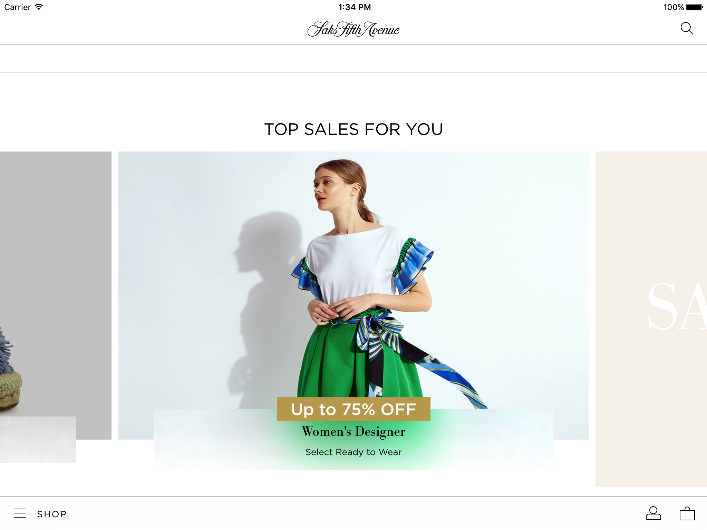
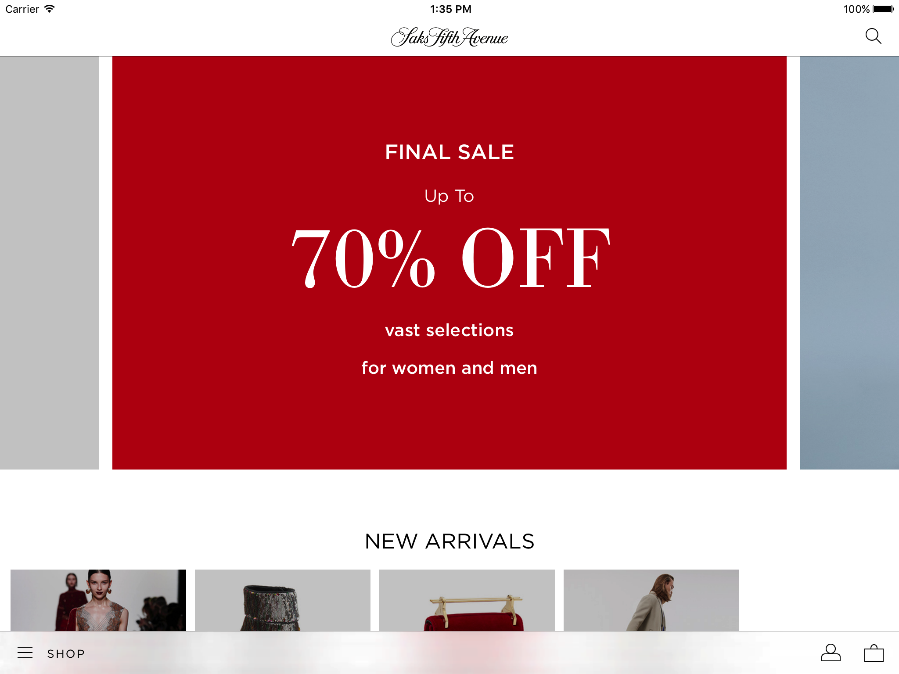
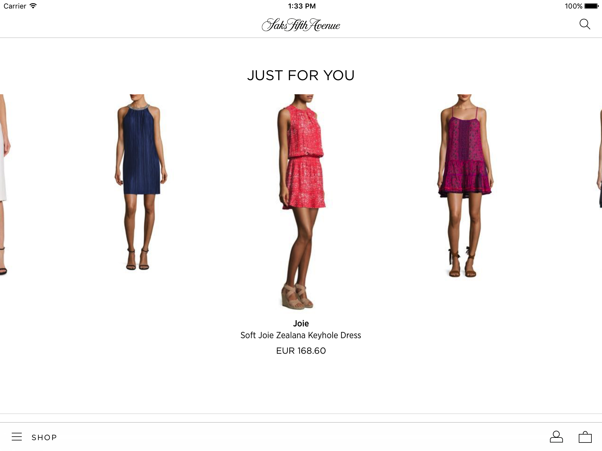

     

# CollectionLayouts
What makes our products unique is the effort that we put in our apps for customizations. 

This repository contains a collection of UICollectionViewLayout subclasses that allow customized behaviors for our UICollectionView.

Included in this repository there are 3 layouts currently used in the Saks 5th Avenue app:

* LNZSnapToCenterCollectionViewLayout
* LNZInfiniteCollectionViewLayout
* LNZCarouselCollectionViewLayout

All the layouts are customizable through interface builder. It is possible to get notified through delegate pattern for updates of their elements in focus, where as element in focus is intended to be the element currently centered.

## LNZSnapToCenterCollectionViewLayout

This layout is a simple horizontal layout that snaps elements to center. The first item is centered by default leaving white space on the left. This behavior is switched off by setting the var `centerFirstItem` to false.

## LNZInfiniteCollectionViewLayout

This layout is an LNZSnapToCenterCollectionViewLayout that reorganize attributes while scrolling so that they are scrollable horizontally indefinitely. 
Each cell maintains their indexPath, and the data source order is not modified by the layout. 
The snap to center behavior can be switched off by modifying the `snapToCenter` var to false.

To be infinite scrollable the data source must contains an amount of items so that the size of the collectionView would be at least 1.5 the screen size. 
The layout will not repeat the elements so that the same items are never visible twice at the same time on screen. In cases where the data source is not 
suitable for an infinite scroll behavior, the LNZInfiniteCollectionViewLayout will fallback on the LNZSnapToCenterCollectionViewLayout behavior. (if the snap to center is disabled, it will remain disabled)

## LNZCarouselCollectionViewLayout

This is an LNZSnapToCenterCollectionViewLayout with the difference that the item considered in focus will appear on full scaled and all the other not in focus items will be scaled down proportionally to the 
distance from the center of the collectionView. The infinite scrolling can be disabled, as well as the snap to center behavior, by setting the properties `isInfiniteScrollEnabled` and `snapToCenter` to false.
The scaling behavior can be customized to obtain the desired scale for items not in focus by changing the properties values `scalingOffset` and `minimumScaleFactor`.

`scalingOffset` represents the distance from the center after which all the items will appear scaled by `minimumScaleFactor`. The items in the center will always have a scale factor of 1.