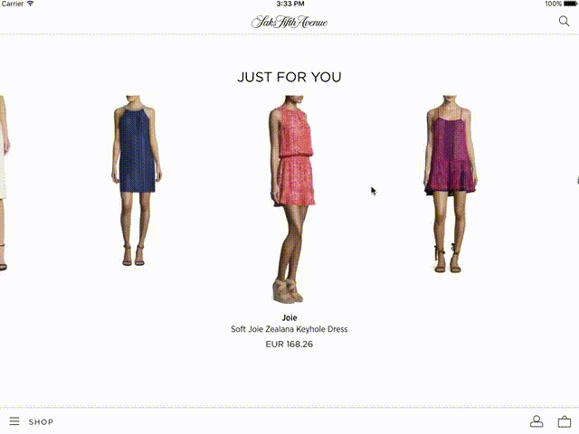

     


# CollectionLayouts
What makes our products unique is the effort that we put in our apps for customizations. 

This repository contains a collection of UICollectionViewLayout subclasses that allow customized behaviors for our UICollectionView.

Included in this repository there are 3 layouts currently used in the Saks 5th Avenue app:

* LNZSnapToCenterCollectionViewLayout
* LNZInfiniteCollectionViewLayout
* LNZCarouselCollectionViewLayout

All the layouts are customizable through interface builder. It is possible to get notified through delegate pattern for updates of their elements in focus, where as element in focus is intended to be the element currently centered.

### Please note

v1.1.4 is compatible with xCode 9.3 and up.


## LNZSnapToCenterCollectionViewLayout


This layout is a simple horizontal layout that snaps elements to center. The first item is centered by default leaving white space on the left. This behavior is switched off by setting the var `centerFirstItem` to false.

## LNZInfiniteCollectionViewLayout


This layout is an LNZSnapToCenterCollectionViewLayout that reorganize attributes while scrolling so that they are scrollable horizontally indefinitely. 
Each cell maintains their indexPath, and the data source order is not modified by the layout. 
The snap to center behavior can be switched off by modifying the `snapToCenter` var to false.

To be infinite scrollable the data source must contains an amount of items so that the size of the collectionView would be at least 1.5 the screen size. 
The layout will not repeat the elements so that the same items are never visible twice at the same time on screen. In cases where the data source is not 
suitable for an infinite scroll behavior, the LNZInfiniteCollectionViewLayout will fallback on the LNZSnapToCenterCollectionViewLayout behavior. (if the snap to center is disabled, it will remain disabled)

## LNZCarouselCollectionViewLayout



This is an LNZSnapToCenterCollectionViewLayout with the difference that the item considered in focus will appear on full scaled and all the other not in focus items will be scaled down proportionally to the 
distance from the center of the collectionView. The infinite scrolling can be disabled, as well as the snap to center behavior, by setting the properties `isInfiniteScrollEnabled` and `snapToCenter` to false.
The scaling behavior can be customized to obtain the desired scale for items not in focus by changing the properties values `scalingOffset` and `minimumScaleFactor`.

`scalingOffset` represents the distance from the center after which all the items will appear scaled by `minimumScaleFactor`. The items in the center will always have a scale factor of 1.

## LNZSafariLayout


This is a collection view that mimics the behavior of safari app tabs. You can delete a tile with a swipe gesture to the left just like in safari and there is embedded a custom animator to trigger a transition 
between the current collectionViewController to the view controller represented by the selected tab.

This layout does not accepts delegates that are `UICollectionViewDelegateFlowLayout` because `LNZSafariLayout` *it is not* a Flow layout. If a delegate of this type is passed to the collectionView, just the methods of the `UICollectionViewDelegate` will be called. 

To enable the delete your delegate must conform `UICollectionViewDelegateSafariLayout` which is a protocol that inherits from `UICollectionViewDelegate` just like the well known `UICollectionViewDelegateFlowLayout`, and implement the methods
`collectionView(_: layout: canDeleteItemAt:)` to decide which cells can be deleted and `collectionView(_: layout: didDeleteItemAt:)` to react to the delete action. This pattern is the same used by `UITableview` to delete a cell by implementing `tableView(_:commit:forRowAt:)` method. 
So in this method you must update your data source accordingly to the change.

To specify a size for each item you must conform to `UICollectionViewDelegateSafariLayout` and implement the optional method `collectionView(_ : layout: sizeForItemAt:)` if not implemented the default size stored in the property `itemSize` will be used as size for each cell of the collection.

If on didSelect of a cell you want to present a view controller using the custom animator your presenting view controller (the one that contains the CollectionView with the `LNZSafariLayout` must conform to `SafariLayoutContaining` protocol, then when the controller is created you should perform these actions:

```
viewController.modalPresentationStyle = .custom
viewController.transitioningDelegate = self
```

By setting the transitioning delegate to self you can choose which is the animator to be used for this controller present and dismiss.

Conforming to the `UIViewControllerTransitioningDelegate` will give you the chance to decide which is the animator to be used.

```
    public func animationController(forPresented presented: UIViewController, presenting: UIViewController, source: UIViewController) -> UIViewControllerAnimatedTransitioning? {
        guard let indexPath = collectionView?.indexPathsForSelectedItems?.first, 
        	let safariLayout = collectionView?.collectionViewLayout as? LNZSafariLayout else { return nil }
        
        return safariLayout.animator(forItem: indexPath)
    }
    
    func animationController(forDismissed dismissed: UIViewController) -> UIViewControllerAnimatedTransitioning? {
        guard let element = (dismissed as? SafariModalViewController)?.presentedElement,
            let item = elements.index(of: element),
            let safariLayout = collectionView?.collectionViewLayout as? LNZSafariLayout else { return nil }
            
        let indexPath = IndexPath(item: item, section: 0)
        let animator = safariLayout.animator(forItem: indexPath)
        animator?.reversed = true
        return animator
    }
```

LNZSafariLayout can configure an animator to be able to animate the transition for the current index Path.
